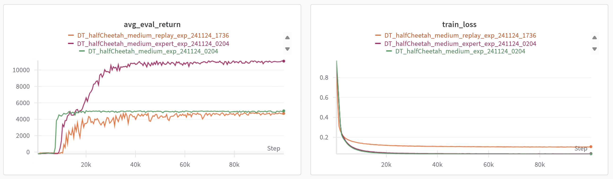

# **Decision Transformer**

This repository contains the implementation for reproducing the **Decision Transformer** model.

- 📄 **Paper**: [Decision Transformer: Reinforcement Learning via Sequence Modeling](http://proceedings.neurips.cc/paper/2021/file/7f489f642a0ddb10272b5c31057f0663-Paper.pdf)  
- 🔗 **Official Code**: [decision-transformer (GitHub)](https://github.com/kzl/decision-transformer)

## **Introduction**
Decision Transformer (DT) bridges the gap between reinforcement learning (RL) and sequence modeling by reformulating decision-making as a sequence modeling problem.  
This repository provides tools to train and evaluate DT on datasets such as `HalfCheetah` and `Hopper` from the D4RL benchmark.

### **Example Training Result**



## **Quick Start**

### **1. Download Datasets**
Download datasets for **`medium`**, **`medium-expert`**, and **`expert`** qualities of the **`HalfCheetah`** and **`Hopper`** environments using the script below:

```bash
$ python download_dataset.py
```

This will fetch the required datasets automatically from D4RL.


### **2. Train the Model**
Use the CLI tool to launch training.  

#### **Example Command**
```bash
$ python cli_train.py --game=HalfCheetah --quality=medium-expert --device=auto --seed=11
```

#### **Command Arguments**
| Argument      | Description                            | Options                                         |
|---------------|----------------------------------------|-------------------------------------------------|
| `--game`      | Environment to train on.               | **`HalfCheetah`**, **`Hopper`**                 |
| `--quality`   | Dataset quality.                       | **`medium`**, **`medium-expert`**, **`expert`** |
| `--device`    | Device for training.                   | **`cuda`**, **`cpu`**, **`auto`**               |
| `--seed`      | Random seed for reproducibility.       | Any integer                                     |


### **3. Manual Configuration**
For manual training configuration, edit the parameters in `train.py` directly and run the script:

```bash
$ python train.py
```


## **Project Structure**

```plaintext
├── data/                  # Directory to store downloaded datasets
├── cli_train.py           # CLI tool for launching training
├── dataset_cleaning.py    # Script for cleaning or preprocessing datasets
├── dataset.py             # Dataset loading and handling utilities
├── download_dataset.py    # Script for downloading datasets
├── model.py               # Model architecture definitions
├── README.md              # Documentation
├── train.py               # Main script for model training
├── training_tools.py      # Additional utilities for training
```


## **References**
- **Paper**: [Decision Transformer: Reinforcement Learning via Sequence Modeling](http://proceedings.neurips.cc/paper/2021/file/7f489f642a0ddb10272b5c31057f0663-Paper.pdf)  
- **Official Code**: [decision-transformer (GitHub)](https://github.com/kzl/decision-transformer)  
- **D4RL Benchmark**: [D4RL (GitHub)](https://github.com/rail-berkeley/d4rl)

Feel free to play with the code ! 🚀
